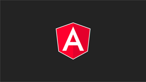
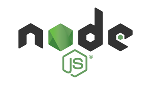

# fwc-2022-sticker-viewer
Projeto desenvolvimento durante o **processo de estudos da plataforma NodeJS**.
Utilizado como hobby e, também, ferramenta para consumo de uma API REST também desenvolvida durante os estudos.

## Conteúdo

* [App :computer:](#app)
* [Sobre](#about)
* [Tecnologias](#technologies)

 &nbsp;

## :pushpin: App :computer:

- [Acesse o app](https://felipewesley.github.io/fwc-2022-sticker-viewer/#/) para explorar os recursos.
- Explore o [projeto da API](https://github.com/felipewesley/sticker-management) que fornece dados para esta aplicação.

 &nbsp;

## :pushpin: Sobre

Este mini-app consiste em uma apresentação visual dos dados retornados por uma API.  
A API em questão pode ser encontrada no [repositório sticker-management](https://github.com/felipewesley/sticker-management), a qual foi desenvolvida durante o processo de estudos da plataforma NodeJS.

 &nbsp;

## :pushpin: Tecnologias

- [x] Angular na versão 14, que inclui as seguintes tecnologias:
    - [x] TypeScript
    - [x] HTML5
    - [x] SCSS - Estilos criados manualmente, sem bibliotecas
    - [x] Angular Material - Biblioteca de componentes
- [x] NodeJs - Plataforma sobra a qual foi desenvolvida a API consumida por esta aplicação, a qual utiliza:
    - [x] TypeScript
    - [x] Framework Express

